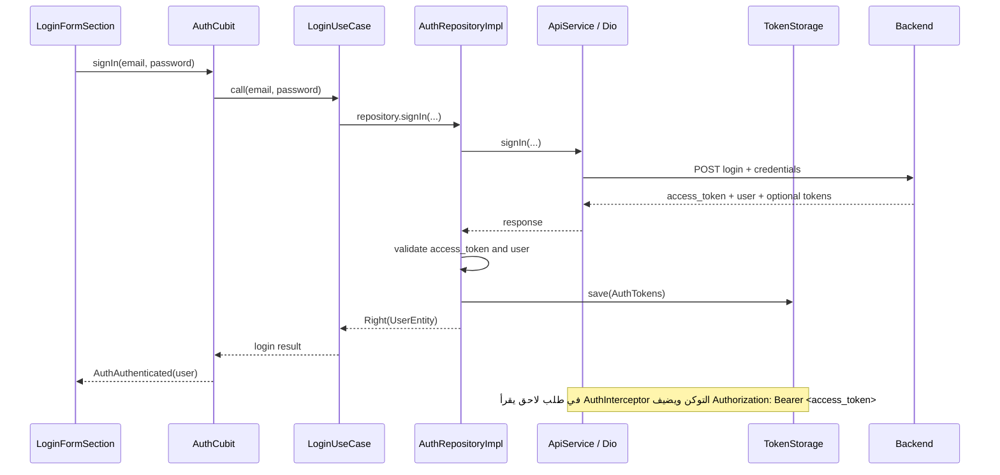

# شرح تسجيل الدخول والتوكن

هذا الدليل يشرح تدفق تسجيل الدخول في المشروع من إدخال البريد وكلمة المرور حتى إرسال طلب محمي بالتوكن. الأمثلة مطابقة للتنفيذ الحالي، وتوضح أيضاً ما لم يُنفذ بعد حتى لا نخلط بين حفظ التوكن وتجديده أو استعادة حالة المستخدم.

## أهداف الدرس

بعد الدرس، يفترض أن يستطيع الطالب:

- تتبع انتقال البيانات من واجهة تسجيل الدخول إلى الخادم ثم العودة.
- التمييز بين `API key` و`access token` و`refresh token`.
- قراءة استجابة login وتحويلها إلى نماذج Dart.
- شرح سبب حفظ الجلسة في تخزين آمن، وكيفية حقن التوكن في طلب لاحق.
- معرفة حدود التنفيذ الحالي ومتطلبات إكمال نظام جلسات كامل.

## الفكرة الأساسية

كلمة المرور تُرسل إلى endpoint تسجيل الدخول مرة واحدة للتحقق من هوية المستخدم. عند النجاح، يرجع الخادم access token. يحتفظ التطبيق بهذا الرمز ويرسله لاحقاً مع الطلبات التي تحتاج صلاحية المستخدم، بدلاً من إعادة إرسال كلمة المرور في كل طلب.



## رحلة تسجيل الدخول بالترتيب

### 1. الطالب يضغط زر الدخول

في [login_form_section.dart](../lib/app/features/auth/auth_features/login/ui/widgets/login_form_section.dart)، تتحقق الواجهة أولاً من الحقول، ثم تقرأ البريد وكلمة المرور من controllers وتستدعي `AuthCubit.signIn`.

الواجهة لا تنفذ HTTP ولا تحفظ التوكن. مسؤوليتها إدخال البيانات وعرض حالات التحميل والنجاح والخطأ.

### 2. Cubit يدير حالة الواجهة

في [auth_cubit.dart](../lib/app/features/auth/logic/cubit/auth_cubit.dart)، يصدر Cubit الحالة `AuthLoading` ثم يستدعي `LoginUseCase`.

- عند النجاح، يصدر `AuthAuthenticated(user)`.
- عند الخطأ، يصدر `AuthError(message)`.

في واجهة الدخول، `BlocConsumer` يستقبل هذه الحالات ويعرض رسالة مناسبة. الانتقال إلى الشاشة التالية معلّق في الواجهة حالياً، لذلك حالة النجاح لا تنقل المستخدم تلقائياً.

### 3. Use case يمرر العملية

في [login_usecase.dart](../lib/app/features/auth/logic/usecase/login_usecase.dart)، يمرر `LoginUseCase` البريد وكلمة المرور إلى `AuthRepository.signIn`.

هذه الطبقة تبقي Cubit بعيداً عن تفاصيل مصدر البيانات. يمكن تغيير طريقة الدخول أو المستودع مع إبقاء الواجهة وCubit أقل ارتباطاً بالشبكة.

### 4. ApiService يرسل الطلب

في [api_service.dart](../lib/app/core/services/network/api_service.dart)، يستخدم التطبيق Dio لإرسال طلب POST. بشكل Supabase الافتراضي يكون المسار:

```http
POST /auth/v1/token?grant_type=password
Content-Type: application/json
apikey: <SUPABASE_ANON_KEY>
Authorization: Bearer <SUPABASE_ANON_KEY>
```

وجسم الطلب:

```json
{
  "email": "student@example.com",
  "password": "example-password"
}
```

الرابط الكامل يتكون من `baseUrl` مع مسار تسجيل الدخول. كلمة المرور مطلوبة في طلب الدخول فقط؛ لا ينبغي إرسالها مع الطلبات العادية بعد نجاح الدخول.

### 5. الخادم يتحقق ويرجع الاستجابة

استجابة نجاح متوقعة:

```json
{
  "access_token": "access-value",
  "refresh_token": "refresh-value",
  "token_type": "Bearer",
  "expires_in": 3600,
  "user": {
    "id": "user-id",
    "email": "student@example.com"
  }
}
```

المفاتيح التي يقرأها التطبيق:

| الحقل           | المعنى                                           | استخدامه الحالي                                                                |
| --------------- | ------------------------------------------------ | ------------------------------------------------------------------------------ |
| `access_token`  | اعتماد المستخدم للطلبات المحمية                  | مطلوب، ويُرسل كـ Bearer token                                                  |
| `refresh_token` | اعتماد يستخدم عادةً للحصول على access token جديد | يُحفظ إن أرسله الخادم، ولا يُستخدم للتجديد تلقائياً حالياً                     |
| `token_type`    | نوع الاعتماد، وغالباً `Bearer`                   | يُستخدم عند تكوين Authorization header، والافتراضي `Bearer`                    |
| `expires_in`    | مدة صلاحية access token بالثواني                 | تُحفظ قيمته فقط، ولا يوجد حالياً منطق لانتهاء الصلاحية                         |
| `user`          | معلومات المستخدم                                 | يجب أن يكون Map ويحتوي `id`؛ البريد يُقرأ أو يؤخذ من البريد المدخل كقيمة بديلة |

العقد الفعلي في المشروع يتطلب `access_token` و`user.id` و`user` من نوع Map. `refresh_token` و`token_type` و`expires_in` اختيارية في النموذج.

## ما الفرق بين أنواع المفاتيح والرموز؟

### API key

مفتاح يعرّف التطبيق أو المشروع للخادم. في Supabase يستخدم العميل `anon key`، وهو مفتاح عميل وليس بديلاً عن حماية البيانات؛ صلاحيات الوصول يجب أن يضبطها الخادم وسياسات قاعدة البيانات مثل RLS.

في إعداد REST العام، `API_KEY` اختياري ويرسل في header اسمه `apikey`. لا تضع مفتاحاً سرياً خاصاً بالخادم داخل تطبيق موبايل؛ القيم المضمنة في التطبيق يمكن استخراجها.

### Access token

يرتبط بجلسة المستخدم ويقدمه التطبيق لإثبات هويته عند طلب بيانات محمية. في هذا المشروع يرسل عادةً بهذا الشكل:

```http
Authorization: Bearer <access_token>
```

التطبيق يتعامل معه كسلسلة نصية ولا يفك JWT أو يقرأ claims منه. الخادم هو من يتحقق من صحة الرمز وصلاحيته.

### Refresh token

يستخدمه كثير من أنظمة المصادقة لطلب access token جديد عندما تنتهي صلاحيته. المشروع يحفظه، لكن لم تتم إضافة endpoint refresh أو retry تلقائي بعد استجابة 401.

## تحويل الاستجابة إلى نموذج

في [auth_tokens.dart](../lib/app/core/services/auth/auth_tokens.dart)، يمثل `AuthTokens` بيانات الجلسة في Dart.

- `AuthTokens.fromJson` يحول مفاتيح JSON إلى خصائص Dart.
- `AuthTokens.toJson` يحول الخصائص إلى JSON للتخزين.
- `accessToken` مطلوب.
- بقية القيم اختيارية أو لها قيمة افتراضية.

المستودع يستخدم `UserEntity` منفصلاً لتمرير بيانات المستخدم إلى حالة الواجهة. هذا يعني أن معلومات الدخول والجلسة لا تختلط مع كائن المستخدم الذي يحتاجه العرض.

## التحقق والحفظ داخل المستودع

في [auth_repo_impl.dart](../lib/app/features/auth/data/repositories/auth_repo_impl.dart)، بعد استلام الرد:

1. يقرأ `response.data`.
2. في Debug فقط، يطبع الرد وقيم access وrefresh token لأغراض العرض والتجربة.
3. يرفض الرد إذا كان access token مفقوداً أو فارغاً.
4. يرفض الرد إذا كان `user` ليس Map.
5. يحول بيانات الجلسة إلى `AuthTokens` ويحفظها.
6. يرجع `Right(UserEntity)` إلى Use case ثم Cubit.

إذا فشل طلب Dio، يحاول المستودع استخراج رسالة الخادم مثل `error_description` أو `message`، ثم يحول بعض الرسائل الشائعة إلى رسائل عربية.

## أين وكيف تُحفظ الجلسة؟

### واجهة التخزين

في [token_storage.dart](../lib/app/core/services/auth/token_storage.dart)، يوجد عقد بثلاث عمليات:

- `save(tokens)` لحفظ الجلسة.
- `read()` لقراءة الجلسة أو إرجاع `null` إذا لم توجد.
- `clear()` لمسح الجلسة.

وجود interface يعني أن المستودع لا يعتمد مباشرةً على plugin بعينه. يمكن كتابة تطبيق آخر للذاكرة في الاختبارات أو تبديل طريقة التخزين مستقبلاً.

### التخزين الآمن

في [secure_token_storage.dart](../lib/app/core/services/auth/secure_token_storage.dart)، التنفيذ يستخدم `flutter_secure_storage`:

1. يحول `AuthTokens` إلى JSON باستخدام `toJson` و`jsonEncode`.
2. يحفظ النص تحت المفتاح `auth_session`.
3. عند القراءة، يجلب النص ويفك JSON ثم ينشئ `AuthTokens`.
4. عند `clear()` يحذف هذا المفتاح.

التطبيق لا يشفر النص يدوياً؛ التخزين الآمن يتولى آلية التخزين المنصة التي يوفرها plugin. لا تسجل التوكنات في ملفات عادية أو SharedPreferences على أنها سرية.

## كيف يضاف التوكن للطلب التالي؟

في [auth_interceptor.dart](../lib/app/core/services/network/auth_interceptor.dart)، `AuthInterceptor` يعترض كل طلب Dio قبل إرساله:

1. يتحقق أن الطلب ليس معلماً بـ `skipAuthToken`.
2. يقرأ الجلسة من `TokenStorage`.
3. إذا وجدها، يضيف `Authorization` باستخدام نوع الرمز وقيمته.
4. يكمل الطلب عبر `handler.next(options)`.

مثال طلب محمي:

```http
GET /profile
Authorization: Bearer access-value
```

طلب login نفسه يستخدم `Options(extra: {'skipAuthToken': true})` حتى لا يأخذ access token قديم من التخزين. الـ `extra` معلومة محلية يقرأها interceptor وليست header ترسل للخادم.

في وضع Supabase قد يحتوي إعداد Dio الأساسي على `Authorization: Bearer <anon key>` لاستخدامه مع المشروع. عندما يجد interceptor جلسة المستخدم، يستبدل قيمة `Authorization` بتوكن المستخدم. يبقى `apikey` منفصلاً.

## اختيار Supabase أو REST عادي

`ApiService.fromEnvironment` يقرأ إعدادات `.env`.

إذا لم يكن `API_BASE_URL` معرفاً، يستخدم المشروع إعدادات Supabase من `SupabaseConfig` والمسار `/auth/v1/token` ويضيف `grant_type=password`.

لخادم REST عادي، مثال:

```env
API_BASE_URL=https://api.example.com
LOGIN_PATH=/auth/login
USE_SUPABASE_GRANT_TYPE=false
API_KEY=client-key-if-required
```

- `API_BASE_URL`: عنوان الخادم.
- `LOGIN_PATH`: endpoint تسجيل الدخول.
- `USE_SUPABASE_GRANT_TYPE=false`: يمنع query الخاص بـ Supabase.
- `API_KEY`: اختياري، يرسل كـ `apikey` ولا يستخدم كـ Bearer لتسجيل الدخول العادي.

إذا لم يحتاج REST backend إلى API key، احذف متغير `API_KEY` من `.env`. لا تتركه موجوداً كقيمة فارغة، لأن الكود يميز بين غياب المتغير وبين وجوده بقيمة فارغة.

يجب أن يرجع endpoint العادي حقول الاستجابة التي يتوقعها التطبيق، أو أن تعدل parsing داخل المستودع ونموذج المستخدم لتطابق عقد الخادم الجديد.

## حالات الخطأ

- لا يوجد access token: يرجع المستودع خطأ يفيد أن الخادم لم يرجع رمز الدخول.
- `user` ليس Map: يرجع فشل تسجيل الدخول.
- فشل اتصال أو HTTP: يعالج `DioException` ويحاول قراءة رسالة الخادم.
- فشل التخزين: يقع ضمن معالجة الأخطاء العامة، فلا يعتبر المستودع تسجيل الدخول ناجحاً إذا لم يتمكن من حفظ الجلسة.
- أخطاء بيانات الدخول: بعض الرسائل المعروفة تحول إلى رسائل عربية للمستخدم.

## ما الذي لا ينفذه المشروع حالياً؟

- لا يجدد access token تلقائياً باستخدام refresh token.
- لا يمسح الجلسة عند تسجيل الخروج من الواجهة؛ `clear()` موجودة فقط في التخزين.
- لا يقرأ الجلسة عند بدء التطبيق ليحول Cubit إلى `AuthAuthenticated`؛ Cubit يبدأ بـ `AuthInitial`.
- خيار «تذكرني» في الواجهة غير مربوط بمنطق التخزين. التخزين الحالي يحدث عند كل login ناجح.
- التنقل بعد `AuthAuthenticated` معلق في شاشة login.
- فرع رسالة تأكيد البريد في Cubit معلّق، ويحتاج إكمالاً قبل الاعتماد عليه.

لذلك وجود التوكن في التخزين يسمح للـ interceptor بقراءته، لكنه لا يعني وحده أن الواجهة استرجعت حالة المستخدم أو أن التوكن سيُجدد عند انتهائه.

## طباعة الرد للعرض داخل الصف

يوجد في `AuthRepositoryImpl` طباعة للـ response الكامل ولـ access/refresh token داخل شرط `kDebugMode`. تظهر في Debug Console أو DevTools أثناء التشغيل Debug، ولا تعمل في Release.

التوكن اعتماد سري لحساب المستخدم. عند العرض للطلاب استخدم حساباً تجريبياً، ولا تشارك تسجيل شاشة أو logs فيها توكن صالح. الأفضل إزالة هذه الطباعة أو إخفاء قيم الرموز بعد انتهاء الشرح.

## الاختبار

في [auth_token_flow_test.dart](../test/auth_token_flow_test.dart)، يستخدم الاختبار تخزيناً مؤقتاً داخل الذاكرة وHTTP adapter وهمياً:

1. يرسل login إلى endpoint REST تجريبي.
2. يعيد adapter استجابة فيها tokens وuser.
3. يتحقق أن API key يرسل في `apikey` وليس Bearer عند login العادي.
4. يتحقق أن access token حفظ وأرسل كـ Bearer في `/profile`.

هذا الاختبار يتحقق من تدفق التطبيق ولا يتصل بخادم حقيقي، ولا يختبر التشفير الفعلي على جهاز Android أو iOS.

## نص قصير للشرح الشفهي

«نرسل البريد وكلمة المرور إلى endpoint الدخول. الخادم يتحقق منهما ويرجع access token ومعلومات المستخدم. نتحقق من وجود التوكن والمستخدم، ثم نحفظ الجلسة في تخزين آمن. بعد ذلك لا نرسل كلمة المرور مرة أخرى؛ Dio interceptor يقرأ access token ويضيفه في Authorization بصيغة Bearer لكل طلب محمي. الـ refresh token محفوظ، لكن تجديد access token وتسجيل الخروج واستعادة الجلسة عند تشغيل التطبيق خطوات مستقلة لم ننفذها بعد».
